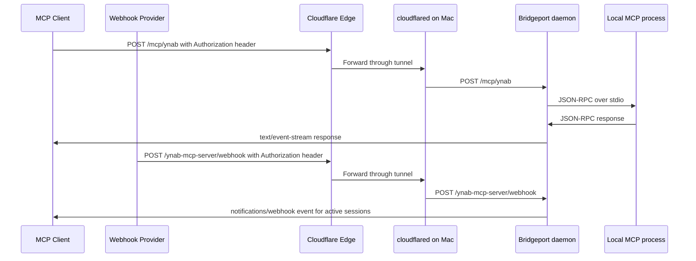

# Cloudflare Tunnel Guide

This guide exposes a local Bridgeport daemon through Cloudflare Tunnel for private MCP access and webhook delivery under a user-owned hostname.

Bridgeport should keep listening on localhost. Cloudflare handles public TLS and forwards only the selected hostname to the Mac.

## Target Shape



## Bridgeport Settings

Use these values in Bridgeport Settings:

| Setting | Value |
|---------|-------|
| Bind Host | `127.0.0.1` |
| Cloudflare enabled | On when public connector exposure is needed |
| Profile | `Personal tunnel` or another descriptive local name |
| Domain | `example.com`, replaced with the user's Cloudflare zone |
| Hostname | `mcp.example.com`, replaced with the selected hostname |
| Tunnel name | `bridgeport` by default |
| Public Base URL | `https://mcp.example.com`, derived from the hostname |
| Allowed Origins | Localhost origins plus the public hostname origin |
| Query-string token fallback | Off, unless a legacy client cannot send headers |

Expose only the connectors that should be reachable remotely by enabling each connector's **Public** toggle.

## Install And Authenticate cloudflared

Bridgeport manages the local tunnel config and LaunchAgent, but `cloudflared` still needs a Cloudflare-authenticated tunnel credential. Install `cloudflared`, then either log in interactively or provide an existing tunnel credentials file.

```bash
brew install cloudflared
cloudflared tunnel login
```

The login command writes the local origin certificate used by `cloudflared tunnel create`. Secret material must stay outside the repository and app bundle. Use 1Password, environment variables, or Cloudflare's local credentials file for private values.

## Bridgeport-Owned Tunnel Lifecycle

Use the Cloudflare settings pane:

1. Set the profile, domain, hostname, tunnel name, and `cloudflared` path.
2. Click **Prepare Local Config** to write Bridgeport's local `cloudflared` config and LaunchAgent.
3. Click **Create or Repair Tunnel** after `cloudflared tunnel login` or equivalent credentials are available.
4. Use **Start Tunnel**, **Stop Tunnel**, or **Restart Tunnel** from Bridgeport after that.

The same lifecycle is available from the CLI:

```bash
swift run bridgeport --cloudflare-status
swift run bridgeport --cloudflare-prepare
swift run bridgeport --cloudflare-bootstrap
swift run bridgeport --cloudflare-start
swift run bridgeport --cloudflare-stop
swift run bridgeport --cloudflare-restart
```

Bridgeport writes the managed tunnel config to `~/.config/bridgeport/cloudflared/config.yml`:

```yaml
tunnel: <TUNNEL_UUID>
credentials-file: /Users/example/.cloudflared/<TUNNEL_UUID>.json
loglevel: warn
transport-loglevel: warn
metrics: localhost:0

ingress:
  - hostname: mcp.example.com
    service: http://127.0.0.1:8080
  - service: http_status:404
```

Bridgeport writes the managed LaunchAgent to `~/Library/LaunchAgents/com.oliverames.bridgeport.cloudflared.plist` and runs:

```bash
cloudflared tunnel --config ~/.config/bridgeport/cloudflared/config.yml run
```

`Create or Repair Tunnel` is idempotent by design. It first asks `cloudflared` for an existing tunnel with the configured name, stores the discovered tunnel ID when found, creates a new named tunnel only when no matching tunnel exists, runs `cloudflared tunnel route dns`, then starts the Bridgeport LaunchAgent. If DNS already points at that tunnel, Bridgeport treats that as an already-converged route rather than creating duplicates.

Verify the running service:

```bash
launchctl print gui/$(id -u)/com.oliverames.bridgeport.cloudflared
```

## Client URLs

Bridgeport generates these in `~/.config/bridgeport/mcp_config.json` for public connectors:

```json
{
  "mcpServers": {
    "ynab-mcp-server": {
      "type": "http",
      "url": "https://mcp.example.com/mcp/ynab",
      "headers": {
        "Authorization": "Bearer ames_..."
      }
    }
  }
}
```

Webhook endpoints use the same bearer-token header:

```http
POST https://mcp.example.com/ynab-mcp-server/webhook
Authorization: Bearer ames_...
Content-Type: application/json
```

Avoid `?token=` URLs for public routes. They leak into logs, browser history, proxy analytics, and screenshots.

## Claude, Mistral, And Cloud Connectors

Bridgeport also writes `~/.config/bridgeport/cloud_connectors.json` and shows the same details in the **Cloud Connectors** settings pane.

Claude, ChatGPT, and Mistral custom connectors connect from cloud infrastructure, so the URL must be reachable from the public internet through Cloudflare. Keep `allowQueryTokenAuth` disabled unless you are testing a legacy client that cannot send headers or use OAuth.

- **Claude app custom connector:** copy the normal remote MCP URL from Bridgeport. Claude discovers Bridgeport's OAuth 2.1 authorization-code flow with PKCE from the protected-resource metadata on unauthorized MCP responses. Bridgeport's approval page requires the Bridgeport token before it issues an OAuth authorization code, so protect the public hostname with Cloudflare Access or equivalent policy and treat the token as a secret.
- **ChatGPT custom app:** use an OAuth front door for production. Bridgeport emits a query-token URL only when fallback is explicitly enabled, and marks ChatGPT as not ready otherwise.
- **Anthropic Messages API:** copy the generated MCP server JSON. It uses `authorization_token`, so the token is not placed in the URL.

Mistral Work/Vibe custom connectors and Vibe Code can use the public URL with Bearer auth:

```text
Server URL: https://mcp.example.com/mcp/ynab
Authorization: Bearer ames_...
```

For reliable Mistral connector-card artwork, use the generated Mistral API create payload from `cloud_connectors.json`. It includes the provider-facing name, Bridgeport's cache-busted `/icons/<connector>?v=...` URL as `icon_url`, plus the private visibility setting and authorization header. For wrapper plugins, Bridgeport prefers the bundled source repo icon before wrapper-level icons.

Bridgeport returns `WWW-Authenticate: Bearer realm="Bridgeport", resource_metadata="..."` on unauthorized requests so OAuth-capable clients can discover authorization metadata and Bearer-capable clients can detect header authentication.

Bridgeport also serves connector-card artwork at `/icons/<connector>`. Icons follow the same exposure rules as MCP routes: enabled connectors are served on localhost, and requests arriving via the public hostname require the connector's Public toggle. MCP `initialize` responses include `serverInfo.icons` and `serverInfo.iconUrl` with a deterministic `?v=` cache key, the endpoint answers conditional requests with `ETag`/`304 Not Modified`, and the Mistral export carries the same cache-busted icon endpoint as `icon_url` for clients that require artwork during connector registration.

## Cloudflare Controls

Recommended controls before exposing more than a small connector set:

1. Cloudflare Access for the MCP hostname, scoped to your account.
2. WAF rules that allow only the expected methods and paths:
   - `POST /mcp/*`
   - `GET /mcp/*` for clients that open a stream directly
   - `DELETE /mcp/*` for session cleanup
   - `POST /*/webhook` for provider webhooks
   - `GET /status` only from trusted locations
3. Rate limiting on the hostname.
4. Separate hostnames if you want to isolate webhook ingress from interactive MCP traffic.

## Local Health Checks

```bash
curl -i \
  -H "Authorization: Bearer <token>" \
  http://localhost:8080/status
```

```bash
curl -i \
  -H "Authorization: Bearer <token>" \
  https://mcp.example.com/status
```
