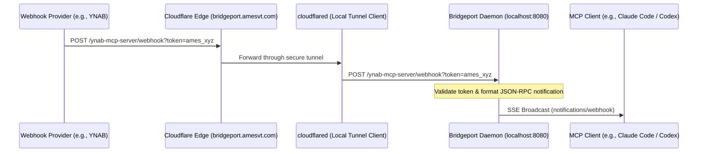

# Cloudflare Tunnels & Webhook Routing Guide

This document describes how to configure a Cloudflare Tunnel (`cloudflared`) to securely expose your local Bridgeport daemon to the internet under your `amesvt.com` domain, enabling external webhooks (e.g., from YNAB, GitHub, or Lytho) to route safely to your always-on Mac.

---

## Architecture Overview



---

## 1. Cloudflare Tunnel Setup

### Install cloudflared
Install the Cloudflare Tunnel daemon on your Mac:
```bash
brew install cloudflared
```

### Authenticate cloudflared
Log in to your Cloudflare account:
```bash
cloudflared tunnel login
```
This will open a browser window. Authenticate and select your domain (`amesvt.com`).

### Create the Tunnel
Create a new tunnel named `bridgeport`:
```bash
cloudflared tunnel create bridgeport
```
This command output will include your **Tunnel UUID** and write a credentials file at `~/.cloudflared/<UUID>.json`.

### Configure the Tunnel
Create a configuration file at `~/.cloudflared/config.yml` with the following contents:

```yaml
tunnel: <TUNNEL_UUID>
credentials-file: /Users/oliverames/.cloudflared/<TUNNEL_UUID>.json

ingress:
  # Route incoming webhook and SSE traffic to the local Bridgeport server
  - hostname: bridgeport.amesvt.com
    service: http://localhost:8080
  
  # Catch-all rule for unmatched traffic
  - service: http_status:404
```

### Route DNS to the Tunnel
Associate your domain/subdomain with the tunnel:
```bash
cloudflared tunnel route dns bridgeport bridgeport.amesvt.com
```

### Run the Tunnel
Test running the tunnel manually:
```bash
cloudflared tunnel run bridgeport
```

---

## 2. Managing the Tunnel as a launchd Agent

To ensure the Cloudflare Tunnel runs persistently in the background on your always-on Mac, configure it as a macOS LaunchAgent.

Create a LaunchAgent plist file at `~/Library/LaunchAgents/com.cloudflare.cloudflared.bridgeport.plist`:

```xml
<?xml version="1.0" encoding="UTF-8"?>
<!DOCTYPE plist PUBLIC "-//Apple//DTD PLIST 1.0//EN" "http://www.apple.com/DTDs/PropertyList-1.0.dtd">
<plist version="1.0">
<dict>
    <key>Label</key>
    <string>com.cloudflare.cloudflared.bridgeport</string>
    <key>ProgramArguments</key>
    <array>
        <string>/opt/homebrew/bin/cloudflared</string>
        <string>tunnel</string>
        <string>--config</string>
        <string>/Users/oliverames/.cloudflared/config.yml</string>
        <string>run</string>
    </array>
    <key>KeepAlive</key>
    <true/>
    <key>RunAtLoad</key>
    <true/>
    <key>StandardOutPath</key>
    <string>/Users/oliverames/.config/bridgeport/cloudflared_stdout.log</string>
    <key>StandardErrorPath</key>
    <string>/Users/oliverames/.config/bridgeport/cloudflared_stderr.log</string>
</dict>
</plist>
```

Load and start the service:
```bash
launchctl bootstrap gui/$(id -u) ~/Library/LaunchAgents/com.cloudflare.cloudflared.bridgeport.plist
```

---

## 3. Webhook Delivery Configuration

Configure your external services to send webhooks to your Cloudflare tunnel endpoint:

* **Webhook Endpoint URL**: `https://bridgeport.amesvt.com/<connector-name>/webhook?token=<your_master_token>`
  * *Example for YNAB*: `https://bridgeport.amesvt.com/ynab-mcp-server/webhook?token=ames_yd8D1WD0...`
* **HTTP Method**: `POST`
* **Content-Type**: `application/json`

---

## 4. Security Recommendations

1. **WAF Rules**: Configure Cloudflare WAF rules on `bridgeport.amesvt.com` to only allow `POST` requests targeting the `/*/webhook` path.
2. **Access Controls**: If you connect to the SSE stream from a fixed remote client location, use Cloudflare Access to gate `GET /*/sse` and `POST /*/message` requests under MTLS or token-authorized policies.
