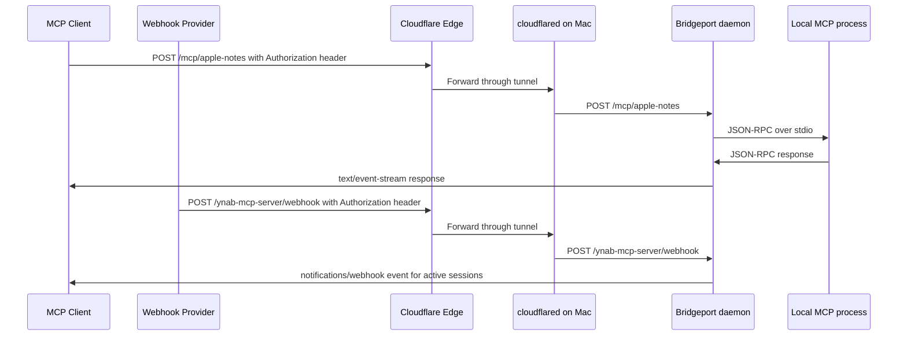

# Cloudflare Tunnel Guide

This guide exposes a local Bridgeport daemon through Cloudflare Tunnel for private MCP access and webhook delivery under an `amesvt.com` hostname.

Bridgeport should keep listening on localhost. Cloudflare handles public TLS and forwards only the selected hostname to the Mac.

## Target Shape



## Bridgeport Settings

Use these values in Bridgeport Settings:

| Setting | Value |
|---------|-------|
| Bind Host | `127.0.0.1` |
| Public Base URL | `https://mcp.amesvt.com` or the selected hostname |
| Allowed Origins | Localhost origins plus the public hostname origin |
| Query-string token fallback | Off, unless a legacy client cannot send headers |

Expose only the connectors that should be reachable remotely by enabling each connector's **Public** toggle.

## Install cloudflared

```bash
brew install cloudflared
cloudflared tunnel login
cloudflared tunnel create bridgeport
```

The create command prints a tunnel UUID and writes credentials to `~/.cloudflared/<UUID>.json`.

## Configure The Tunnel

Create or update `~/.cloudflared/config.yml`:

```yaml
tunnel: <TUNNEL_UUID>
credentials-file: /Users/oliverames/.cloudflared/<TUNNEL_UUID>.json

ingress:
  - hostname: mcp.amesvt.com
    service: http://localhost:8080
  - service: http_status:404
```

Create the DNS route:

```bash
cloudflared tunnel route dns bridgeport mcp.amesvt.com
```

Run it manually for a first test:

```bash
cloudflared tunnel run bridgeport
```

## Run As A LaunchAgent

Create `~/Library/LaunchAgents/com.cloudflare.cloudflared.bridgeport.plist`:

```xml
<?xml version="1.0" encoding="UTF-8"?>
<!DOCTYPE plist PUBLIC "-//Apple//DTD PLIST 1.0//EN" "http://www.apple.com/DTDs/PropertyList-1.0.dtd">
<plist version="1.0">
<dict>
    <key>Label</key>
    <string>com.cloudflare.cloudflared.bridgeport</string>
    <key>ProgramArguments</key>
    <array>
        <string>/opt/homebrew/bin/cloudflared</string>
        <string>tunnel</string>
        <string>--config</string>
        <string>/Users/oliverames/.cloudflared/config.yml</string>
        <string>run</string>
    </array>
    <key>KeepAlive</key>
    <true/>
    <key>RunAtLoad</key>
    <true/>
    <key>StandardOutPath</key>
    <string>/Users/oliverames/.config/bridgeport/cloudflared_stdout.log</string>
    <key>StandardErrorPath</key>
    <string>/Users/oliverames/.config/bridgeport/cloudflared_stderr.log</string>
</dict>
</plist>
```

Load it:

```bash
launchctl bootstrap gui/$(id -u) ~/Library/LaunchAgents/com.cloudflare.cloudflared.bridgeport.plist
launchctl print gui/$(id -u)/com.cloudflare.cloudflared.bridgeport
```

## Client URLs

Bridgeport generates these in `~/.config/bridgeport/mcp_config.json` for public connectors:

```json
{
  "mcpServers": {
    "ynab-mcp-server": {
      "type": "http",
      "url": "https://mcp.amesvt.com/mcp/ynab-mcp-server",
      "headers": {
        "Authorization": "Bearer ames_..."
      }
    }
  }
}
```

Webhook endpoints use the same bearer-token header:

```http
POST https://mcp.amesvt.com/ynab-mcp-server/webhook
Authorization: Bearer ames_...
Content-Type: application/json
```

Avoid `?token=` URLs for public routes. They leak into logs, browser history, proxy analytics, and screenshots.

## Claude, Mistral, And Cloud Connectors

Bridgeport also writes `~/.config/bridgeport/cloud_connectors.json` and shows the same details in the **Cloud Connectors** settings pane.

Claude, ChatGPT, and Mistral custom connectors connect from cloud infrastructure, so the URL must be reachable from the public internet through Cloudflare. Keep `allowQueryTokenAuth` disabled unless you are testing a legacy client that cannot send headers or use OAuth.

- **Claude app custom connector:** copy the normal remote MCP URL from Bridgeport. Claude discovers Bridgeport's OAuth 2.1 authorization-code flow with PKCE from the protected-resource metadata on unauthorized MCP responses. Bridgeport's approval page requires the Bridgeport token before it issues an OAuth authorization code, so protect the public hostname with Cloudflare Access or equivalent policy and treat the token as a secret.
- **ChatGPT custom app:** use an OAuth front door for production. Bridgeport emits a query-token URL only when fallback is explicitly enabled, and marks ChatGPT as not ready otherwise.
- **Anthropic Messages API:** copy the generated MCP server JSON. It uses `authorization_token`, so the token is not placed in the URL.

Mistral Work/Vibe custom connectors and Vibe Code can use the public URL with Bearer auth:

```text
Server URL: https://mcp.amesvt.com/mcp/ynab-mcp-server
Authorization: Bearer ames_...
```

For reliable Mistral connector-card artwork, use the generated Mistral API create payload from `cloud_connectors.json`. It includes Bridgeport's cache-busted `/icons/<connector>?v=...` URL as `icon_url`, plus the private visibility setting and authorization header.

Bridgeport returns `WWW-Authenticate: Bearer realm="Bridgeport", resource_metadata="..."` on unauthorized requests so OAuth-capable clients can discover authorization metadata and Bearer-capable clients can detect header authentication.

Bridgeport also serves connector-card artwork at `/icons/<connector>`. MCP `initialize` responses include `serverInfo.icons` and `serverInfo.iconUrl` with a deterministic `?v=` cache key, and the Mistral export carries the same cache-busted icon endpoint as `icon_url` for clients that require artwork during connector registration.

## Cloudflare Controls

Recommended controls before exposing more than a small connector set:

1. Cloudflare Access for the MCP hostname, scoped to your account.
2. WAF rules that allow only the expected methods and paths:
   - `POST /mcp/*`
   - `GET /mcp/*` for clients that open a stream directly
   - `DELETE /mcp/*` for session cleanup
   - `POST /*/webhook` for provider webhooks
   - `GET /status` only from trusted locations
3. Rate limiting on the hostname.
4. Separate hostnames if you want to isolate webhook ingress from interactive MCP traffic.

## Local Health Checks

```bash
curl -i \
  -H "Authorization: Bearer <token>" \
  http://localhost:8080/status
```

```bash
curl -i \
  -H "Authorization: Bearer <token>" \
  https://mcp.amesvt.com/status
```
