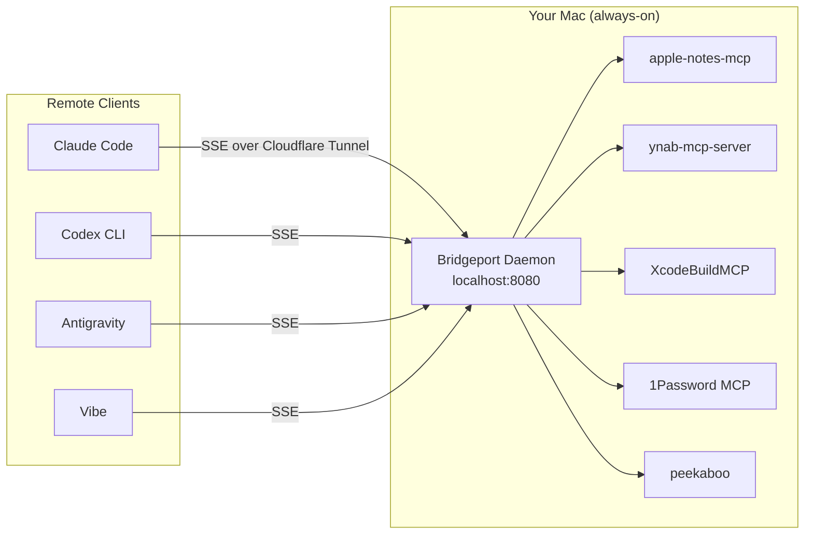

# Bridgeport

**A macOS menu bar utility that bridges local MCP (Model Context Protocol) servers to remote AI coding agents over SSE.**

Bridgeport runs as a persistent background daemon, discovering and managing MCP connectors from your local plugin directories. It exposes each connector as an HTTP SSE endpoint that remote clients (Claude Code, Codex, Vibe, Antigravity) can connect to — turning your always-on Mac into a gateway for local-only services like Apple Notes, YNAB, 1Password, and hardware-bound tools.

---

## Architecture



### What Bridgeport Does

1. **Discovers** MCP connectors from a plugin directory (`.mcp.json`, `.claude-plugin/plugin.json`, `.antigravity-plugin/mcp_config.json`)
2. **Filters** — only includes connectors that need a local process bridge (skips web-hosted MCPs like `sosumi` or `agent-tinyfish-ai` that already have public URLs)
3. **Spawns** each connector's subprocess on demand when a client connects
4. **Bridges** JSON-RPC messages between the SSE stream and the subprocess's stdin/stdout
5. **Authenticates** all requests with a bearer token
6. **Receives webhooks** from external services and broadcasts them as JSON-RPC notifications to active sessions

### What Bridgeport Does NOT Do

- It does not replace web-accessible MCP servers. If a service already has a public HTTP endpoint, connect directly.
- It does not manage credentials for you (use 1Password `op://` references in your config).

---

## Quick Start

### Build
```bash
swift build
```

### Run as Menu Bar App (GUI)
```bash
swift run bridgeport
```
This opens a macOS menu bar utility where you can toggle connectors on/off, manage the daemon, and configure settings.

### Run as Background Server (Headless)
```bash
swift run bridgeport --server
```

### Install as LaunchAgent (Persistent Daemon)
```bash
swift run bridgeport --daemon-install
```
This copies the binary to `~/.config/bridgeport/bin/`, writes a LaunchAgent plist, and starts the service.

### Uninstall
```bash
swift run bridgeport --daemon-uninstall
```

### Check Status
```bash
swift run bridgeport --daemon-status
```

---

## Configuration

All configuration is stored at `~/.config/bridgeport/config.json`:

```json
{
  "token": "ames_...",
  "port": 8080,
  "connectorsPath": "/path/to/your/connector/plugins",
  "env": {
    "YNAB_API_TOKEN": "op://...",
    "GOOGLE_WORKSPACE_OAUTH_CLIENT_ID": "..."
  },
  "disabledConnectors": ["XcodeBuildMCP"]
}
```

### Client Config (Auto-Generated)

Bridgeport writes a standard MCP client config to `~/.config/bridgeport/mcp_config.json` that other tools can read:

```json
{
  "mcpServers": {
    "apple-notes": {
      "type": "sse",
      "url": "http://localhost:8080/apple-notes/sse?token=ames_..."
    }
  }
}
```

### Environment & Credentials

Bridgeport resolves environment variables in connector configs using this priority:
1. `config.json` → `env` overrides
2. Process environment
3. `op://` references → resolved via 1Password CLI

On first run, Bridgeport seeds its env from `~/.claude/settings.json` if present.

---

## Connector Discovery

Bridgeport scans the `connectorsPath` directory for plugin folders containing any of:

| File | Format |
|------|--------|
| `.mcp.json` | `{ "serverName": { "command": "...", "args": [...], "env": {...} } }` |
| `.claude-plugin/plugin.json` | `{ "mcpServers": { "serverName": { ... } } }` |
| `.antigravity-plugin/mcp_config.json` | Same as `.mcp.json` |

**Filtering rules:**
- Connectors with a `url` key but no `command` are skipped (they're web-hosted and don't need Bridgeport)
- Duplicate connector names are deduplicated (first discovery wins)
- Results are sorted alphabetically

---

## Webhooks

Bridgeport accepts incoming webhooks and broadcasts them to active SSE sessions:

```
POST /:connector/webhook?token=<your_token>
Content-Type: application/json

{ "event": "transaction.created", ... }
```

This is forwarded to all active SSE sessions for that connector as a JSON-RPC notification:

```json
{
  "jsonrpc": "2.0",
  "method": "notifications/webhook",
  "params": {
    "connector": "ynab-mcp-server",
    "payload": { "event": "transaction.created", ... }
  }
}
```

For exposing webhooks to the internet via Cloudflare Tunnel, see [CLOUDFLARE.md](CLOUDFLARE.md).

---

## CLI Reference

| Flag | Description |
|------|-------------|
| `--server` | Run in headless server mode (no GUI) |
| `--port <port>` | HTTP port (default: 8080) |
| `--token <token>` | Bearer token for auth |
| `--connectors-path <path>` | Path to connector plugins directory |
| `--daemon-install` | Install and start as LaunchAgent |
| `--daemon-uninstall` | Stop and remove LaunchAgent |
| `--daemon-status` | Show daemon status |
| `--rotate-token` | Generate a new API token and restart |

---

## Project Structure

```
bridgeport/
├── Sources/bridgeport/
│   ├── bridgeport.swift          # CLI entry point & daemon management
│   ├── BridgeportApp.swift       # SwiftUI menu bar app
│   ├── AppState.swift            # Observable UI state & daemon control
│   ├── ConfigManager.swift       # Config persistence & client config generation
│   ├── ConnectorManager.swift    # Plugin discovery, env resolution, 1Password
│   ├── SSEServer.swift           # HTTP server (SSE, message relay, webhooks)
│   ├── ProcessBridge.swift       # Subprocess lifecycle & stdin/stdout bridge
│   ├── DebugLog.swift            # Timestamped stderr logging
│   └── Views/
│       └── SettingsView.swift    # macOS Settings window (General, Security, Connectors)
├── Package.swift
├── CLOUDFLARE.md                 # Cloudflare Tunnel setup guide
├── script/
│   └── build_and_run.sh          # Build .app bundle and launch
└── test_client.py                # SSE test client
```

---

## Requirements

- macOS 14+ (Sonoma)
- Swift 6.0+
- [FlyingFox](https://github.com/swhitty/FlyingFox) (HTTP server, via SwiftPM)

---

## License

Private. © Oliver Ames.
