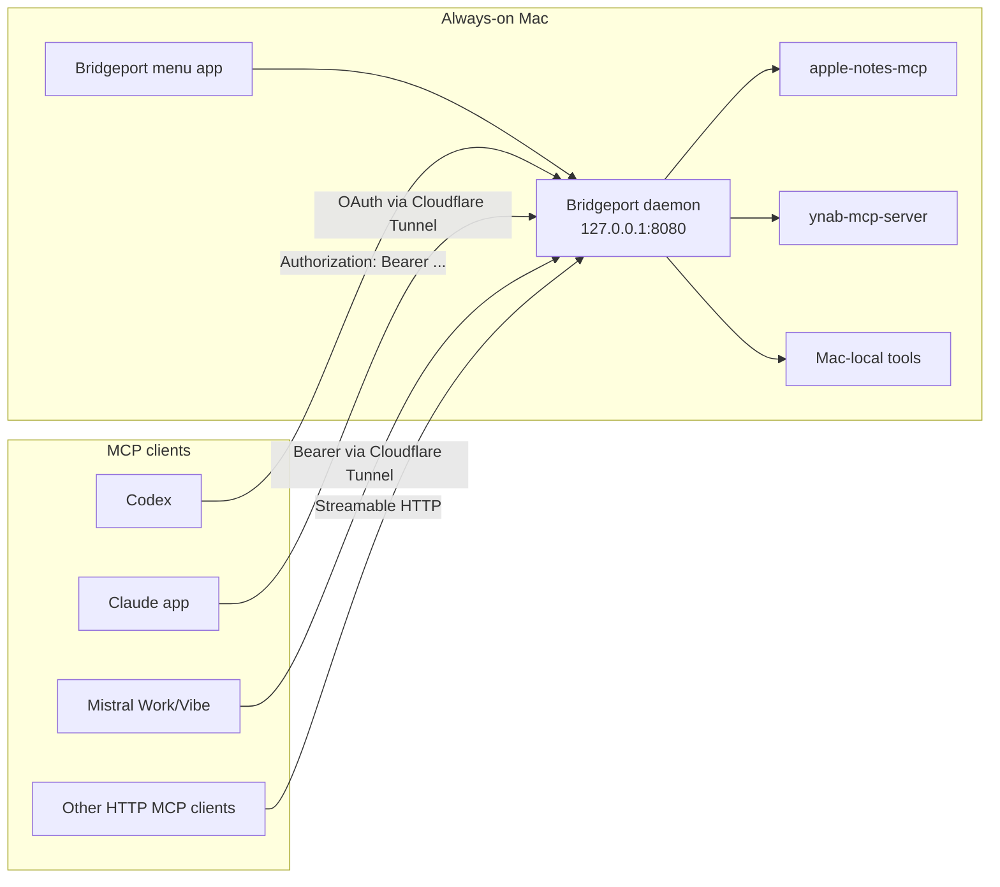

# Bridgeport

<p align="center">
  
</p>

<p align="center">
  <strong>Personal MCP gateway for Mac-local connectors.</strong>
</p>

Bridgeport is a macOS 26 Tahoe menu bar utility and LaunchAgent daemon that turns this Mac into a personal MCP gateway. It discovers local stdio MCP servers from the tools already installed on the Mac, runs them on demand, and exposes them as authenticated local or Cloudflare-routed MCP endpoints.

Bridgeport is intended for connectors that need this Mac, local app data, local credentials, or inexpensive personal hosting. URL-only MCP servers are skipped because they already have hosted equivalents.

> **Release status:** Source builds and a signed, notarized DMG are available from the GitHub releases. See [Releasing Bridgeport](RELEASING.md) for verification and release details.

## What It Does



Bridgeport:

1. Discovers MCP servers from plugin folders, `.mcp.json`, Claude plugin manifests, Codex plugin manifests, Antigravity MCP configs, Hermes plugin manifests, `.claude/settings.json`, and `.codex/config.toml`.
2. Skips web-hosted MCP entries that have a `url` and no local `command`.
3. Imports MCP definitions into Bridgeport-owned config, or mirrors external sources live.
4. Spawns each connector process on demand and bridges JSON-RPC over stdin/stdout.
5. Exposes modern Streamable HTTP endpoints at `/mcp/<connector>` plus legacy SSE endpoints at `/<connector>/sse` and `/<connector>/message`.
6. Authenticates with `Authorization: Bearer <token>` by default and advertises OAuth 2.1 metadata for cloud custom-connector clients.
7. Generates cloud connector exports for Claude custom connectors, ChatGPT custom apps, Anthropic Messages API MCP connectors, Mistral Work/Vibe custom connectors, and Vibe Code CLI.
8. Shows active sessions, enabled connector count, public exposure state, and connector source paths in the UI.
9. Resolves only the secrets each connector declares or references from process env, a mounted 1Password Environment `.env` file, Bridgeport config env, connector env, and `op://` references. Defaults are seeded from `~/.claude/.env` so Bridgeport stores references, not plaintext secrets.
10. Serves connector icons from bundled local assets, declared HTTPS logo URLs, or deterministic SVG fallbacks so cloud connector cards do not fall back to tunnel-provider branding. Icons follow the same exposure rules as MCP routes (enabled connectors locally, Public-toggled connectors on the tunnel hostname) and carry `ETag` validators so provider caches refresh when artwork changes.
11. Shows a per-connector **Step-by-Step Setup** guide in the Cloud Connectors pane with numbered instructions and one-click copy buttons for everything Claude, ChatGPT/Codex, and Mistral ask for during custom-connector setup.

## Quick Start

Build:

```bash
swift build
```

Run the menu bar app:

```bash
swift run bridgeport
```

Run the daemon directly:

```bash
swift run bridgeport --server
```

Install as a persistent LaunchAgent:

```bash
swift run bridgeport --daemon-install
```

Check daemon status:

```bash
swift run bridgeport --daemon-status
```

Run tests and smoke verification:

```bash
swift test
python3 test_client.py
```

Build and launch the `.app` bundle:

```bash
script/build_and_run.sh --verify
```

To assemble the app without launching it and exercise a fresh isolated installation:

```bash
script/build_and_run.sh --build-only
script/verify_clean_install.sh dist/Bridgeport.app
```

## Configuration

Bridgeport stores its config at `~/.config/bridgeport/config.json`.

Fresh installs use `~/.config/bridgeport/connectors` as the neutral primary source and leave Cloudflare identity fields blank. The expanded example below shows a user-configured public hostname.

```json
{
  "token": "ames_...",
  "port": 8080,
  "publicBaseURL": "https://mcp.example.com",
  "bindHost": "127.0.0.1",
  "allowedOrigins": [
    "http://localhost:8080",
    "http://127.0.0.1:8080",
    "https://mcp.example.com"
  ],
  "allowQueryTokenAuth": false,
  "connectorsPath": "/Users/example/.config/bridgeport/connectors",
  "additionalConnectorPaths": [
    "/Users/example/.claude/settings.json",
    "/Users/example/.codex/config.toml"
  ],
  "connectorSettings": {
    "ynab-mcp-server": {
      "enabled": true,
      "exposePublicly": true,
      "publicPath": "ynab"
    },
    "apple-notes": {
      "enabled": true,
      "exposePublicly": false
    }
  },
  "onePasswordEnvironment": {
    "enabled": true,
    "environmentName": "Bridgeport",
    "accountId": "",
    "environmentId": "",
    "localEnvFilePath": "~/.config/bridgeport/1password.env"
  },
  "cloudflare": {
    "enabled": true,
    "profileName": "Personal tunnel",
    "accountId": "",
    "zoneId": "",
    "domain": "example.com",
    "hostname": "mcp.example.com",
    "tunnelName": "bridgeport",
    "tunnelId": "",
    "credentialsFilePath": "",
    "configFilePath": "~/.config/bridgeport/cloudflared/config.yml",
    "cloudflaredPath": "/opt/homebrew/bin/cloudflared",
    "launchAgentLabel": "com.oliverames.bridgeport.cloudflared",
    "routeMode": "single-hostname-path-routing",
    "apiTokenEnvVar": "CLOUDFLARE_API_TOKEN",
    "apiTokenOPReference": "",
    "createdByBridgeport": false
  },
  "env": {
    "YNAB_API_TOKEN": "op://Development/<item>/<field>"
  }
}
```

For test isolation, `BRIDGEPORT_CONFIG_HOME=/tmp/bridgeport-test` redirects `config.json`, `mcp_config.json`, `cloud_connectors.json`, `oauth_clients.json`, and `oauth_tokens.json`.

## Generated MCP Client Config

Bridgeport writes enabled connectors to `~/.config/bridgeport/mcp_config.json`.

```json
{
  "mcpServers": {
    "ynab-mcp-server": {
      "type": "http",
      "url": "https://mcp.example.com/mcp/ynab",
      "headers": {
        "Authorization": "Bearer ames_..."
      }
    }
  }
}
```

Query-string tokens are disabled by default. Keep them off unless a legacy client cannot send headers. Public route paths are normalized to a safe single path segment before generated URLs are written.

## Cloud Connector Exports

Bridgeport writes public connector exports to `~/.config/bridgeport/cloud_connectors.json` and surfaces the same values in the **Cloud Connectors** settings pane. Only enabled connectors with the **Public** toggle are included.

ChatGPT custom apps, Claude custom connectors, and Mistral custom connectors are reached from cloud infrastructure, not from this Mac. Set `publicBaseURL` to a Cloudflare Tunnel hostname, keep `allowQueryTokenAuth` off, and expose only the connectors you intend to make public.

For example, a user can expose `ynab-mcp-server` at `https://mcp.example.com/mcp/ynab` while keeping Apple Notes local. A discovered connector is not exposed publicly unless its **Public** toggle is deliberately enabled.

Claude custom connectors use Bridgeport's built-in OAuth 2.1 authorization-code flow with PKCE and dynamic client registration. The remote MCP URL is the normal endpoint, for example `https://mcp.example.com/mcp/ynab`; Claude discovers Bridgeport's authorization and token endpoints from the protected-resource metadata advertised on 401 responses. The Bridgeport approval page requires the Bridgeport token before it issues an OAuth authorization code, so keep the public hostname behind Cloudflare Access or equivalent policy and treat that token as a secret. Failed approval attempts are delayed to slow online guessing, and token endpoint responses are marked `Cache-Control: no-store` per RFC 6749.

ChatGPT custom apps currently require an OAuth front door for production. Bridgeport exports a query-token URL only when fallback is explicitly enabled, otherwise it copies the normal MCP URL and marks the ChatGPT entry as not ready.

Anthropic Messages API MCP connector definitions use `authorization_token`, so they can keep header-style auth without putting a token in the URL:

```json
{
  "type": "url",
  "name": "ynab-mcp-server",
  "url": "https://mcp.example.com/mcp/ynab",
  "authorization_token": "ames_..."
}
```

Mistral Work/Vibe custom connectors can use the same public MCP URL and select or auto-detect HTTP Bearer Token auth in the UI:

```text
Name: YNAB (BridgePort)
Server URL: https://mcp.example.com/mcp/ynab
Authentication: HTTP Bearer Token
Authorization header: Bearer ames_...
```

For connector-card artwork, prefer the generated Mistral API create payload in `cloud_connectors.json`. It includes the server URL, private visibility, bearer header, provider-facing title-case name, and Bridgeport's cache-busted `/icons/<connector>?v=...` URL as `icon_url`. For wrapper plugins, Bridgeport prefers the bundled source repo icon, for example `sources/ynab-mcp-server/assets/icon.png`, before wrapper-level icons.

Vibe Code CLI can use the generated TOML:

```toml
[[mcp_servers]]
name = "ynab-mcp-server"
transport = "streamable-http"
url = "https://mcp.example.com/mcp/ynab"
headers = { "Authorization" = "Bearer ames_..." }
```

Provider authentication summary:

| Provider | Recommended production auth | Bridgeport export behavior |
|----------|-----------------------------|----------------------------|
| ChatGPT custom apps | OAuth in front of the remote MCP endpoint | Copies a query-token URL only when fallback is enabled, otherwise marks the URL as not ready |
| Claude app custom connectors | Bridgeport OAuth 2.1 with PKCE | Copies the normal remote MCP URL and marks it ready |
| Anthropic Messages API | `authorization_token` | Exports header-style bearer auth without URL tokens |
| Mistral Work/Vibe custom connectors | HTTP Bearer Token | Exports server URL plus `Bearer <token>` |
| Vibe Code CLI | Authorization header in TOML | Exports `streamable-http` TOML with bearer header |

The **Cloud Connectors** pane shows a collapsible **Step-by-Step Setup** guide per public connector. Each provider section lists the exact clicks in that provider's UI and pairs them with copy buttons for the values that step needs: the MCP URL and Bridgeport token for Claude, the MCP URL for ChatGPT/Codex, and the MCP URL, `Bearer` header value, or full Mistral JSON payload for Mistral. Copy buttons flash "Copied" so it is always clear the value is on the clipboard.

Before creating a provider connector, search the provider's connector list for existing Bridgeport entries and remove or reuse stale test entries. Keep exactly one Bridgeport connector per exposed MCP in each provider. Do not create Bridgeport duplicates for HTML/web-native connectors that already have hosted provider integrations.

## Import vs Mirror

Use **Import MCPs** when you want Bridgeport to copy connector definitions into its own config. Imported connectors keep working even if the original plugin folder moves, as long as the referenced command still exists.

Use **Mirror MCPs From...** when you want Bridgeport to keep reading an external source live. Good mirror sources include:

- `/Users/example/Developer/Projects/local-mcp-servers`
- `/Users/example/.claude/settings.json`
- `/Users/example/.codex/config.toml`
- `/Users/example/.claude/plugins/cache/example-plugin/example-mcp/<version>`

The Sources settings pane also has one-click actions for the default Claude Code and Codex config paths. Both flows keep URL-only web MCPs out of Bridgeport and default newly discovered local MCPs to private, non-public exposure.

## Environment And 1Password

Connector processes receive environment values in this order. User-owned values win over connector defaults so a mirrored MCP definition cannot silently override local safety settings such as `YNAB_ALLOW_WRITES=0`.

1. Bridgeport daemon process environment.
2. Mounted 1Password Environment `.env` file, when enabled in Settings.
3. Bridgeport `env` values from `config.json`.
4. Connector-specific `env` values from the MCP definition, for keys not already present.

Values can reference earlier user-owned environment variables with `${NAME}` and can use `op://` references. Bridgeport resolves `op://` values with the 1Password CLI (`op read`) at connector start, but only for variables the connector declares or references. Unused `op://` entries are not resolved or injected into unrelated connector processes, and each 1Password CLI read has a timeout so a locked vault cannot stall connector startup indefinitely.

The 1Password settings pane stores metadata for the Environment plus the local mounted `.env` path. It does not create or mutate a 1Password Environment itself.
Mounted 1Password local env destinations are read as regular dotenv files or nonblocking FIFO mounts, so a temporarily inactive 1Password mount cannot stall connector startup.

## Safe YNAB Validation

`ynab-mcp-server` is Bridgeport's primary live test connector because it proves hosted MCP access without requiring Apple Notes data to leave the Mac. Production YNAB remains read/write-capable when the source connector enables writes, but release validation must stay read-only.

For safe testing:

1. Use read-only tools such as `review_unapproved` with `summary: true`.
2. Do not call tools that create, update, approve, categorize, import, delete, or otherwise mutate YNAB data.
3. If a temporary validation run needs a hard read-only guard, set `YNAB_ALLOW_WRITES=0` in Bridgeport's config env for that run, then remove the override before reconnecting production providers.
4. Confirm provider conversations can list transactions needing approval, then stop. Do not approve or edit them from the provider chat.

## Endpoints

Modern Streamable HTTP:

```http
POST /mcp/<connector>
Authorization: Bearer <token>
Accept: application/json, text/event-stream
Content-Type: application/json
```

Legacy SSE:

```http
GET /<connector>/sse
Authorization: Bearer <token>
```

Webhook broadcast:

```http
POST /<connector>/webhook
Authorization: Bearer <token>
Content-Type: application/json
```

Runtime status:

```http
GET /status
Authorization: Bearer <token>
```

OAuth discovery for Claude-style custom connectors:

```http
GET /.well-known/oauth-protected-resource/mcp/<connector>
GET /.well-known/oauth-authorization-server
POST /oauth/register
GET /oauth/authorize
POST /oauth/token
```

Connector icon assets:

```http
GET /icons/<connector>
```

Bridgeport advertises icon metadata in MCP `initialize` responses with `serverInfo.icons` and `serverInfo.iconUrl`. Public connectors advertise the tunnel icon URL; private connectors advertise a localhost icon URL so local MCP clients still resolve artwork. Mistral exports and initialize icon URLs include a deterministic `?v=` cache key, and the icon endpoint answers conditional requests with `ETag`/`304 Not Modified`, so cloud providers refresh stale connector-card artwork after local assets change. Icon files are matched from source-repo assets first (`sources/<name>/assets/icon.png`), then wrapper `assets`, `images`, `public`, and repo-root `icon.*`/`logo.*` files, then HTTPS logo URLs declared in plugin manifests, and finally a generated monogram SVG.

Session lifecycle: `Mcp-Session-Id` values are scoped to the connector that issued them, `DELETE` closes the session and stops its connector subprocess, and sessions with no open streams and no traffic for 10 minutes are reaped automatically so disconnected clients cannot leak connector processes. A client that reuses a reaped session id receives 404 and re-initializes per the Streamable HTTP spec. The daemon caps live sessions at 64 and answers further session-opening requests with `503` and `Retry-After`, so a reconnect-looping client cannot exhaust the Mac with connector subprocesses. Connector discovery results are cached for two seconds on the serving path, keeping per-request latency flat without a filesystem walk per request.

OAuth dynamic client registrations and issued access tokens are persisted privately under `~/.config/bridgeport/`, so connected Claude custom connectors survive daemon restarts without re-authorizing.

## Cloudflare

Bridgeport owns the local Cloudflare Tunnel lifecycle. The Cloudflare settings pane stores non-secret account metadata, a hostname such as `mcp.example.com`, the named tunnel, the local `cloudflared` path, and Bridgeport's generated `cloudflared` config path. Secrets stay outside the app bundle and repository: use `cloudflared tunnel login`, a local credentials file, a tunnel token, environment variables, or `op://` references.

The production shape is a named tunnel with one hostname and Bridgeport path routing:

- `cloudflared` forwards `https://mcp.example.com` to `http://127.0.0.1:<port>`.
- Bridgeport serves `/mcp/<connector>` only when that connector is enabled.
- Public-host requests for private or disabled connectors return unavailable rather than reaching the local MCP process.
- Generated connector URLs and Mistral `icon_url` values use Bridgeport metadata, not Cloudflare branding.

Use **Prepare Local Config** to write `~/.config/bridgeport/cloudflared/config.yml` and `~/Library/LaunchAgents/com.oliverames.bridgeport.cloudflared.plist` without creating DNS records. Use **Create or Repair Tunnel** after `cloudflared tunnel login` or equivalent credentials are available; Bridgeport will reuse an existing named tunnel when it can, create one only when needed, route the configured hostname, and start the LaunchAgent.

Expose connectors individually with their **Public** toggle. The generated client config uses the public base URL only for connectors marked public, and `cloud_connectors.json` includes only enabled public connectors.

See [CLOUDFLARE.md](CLOUDFLARE.md) for tunnel setup and security recommendations.

## CLI Reference

| Flag | Description |
|------|-------------|
| `--server` | Run in headless daemon mode |
| `--port <port>` | HTTP port |
| `--token <token>` | Master bearer token |
| `--connectors-path <path>` | Primary MCP source path |
| `--public-base-url <url>` | Public base URL for generated client config |
| `--bind-host <host>` | Bind host, default `127.0.0.1` |
| `--allow-query-token-auth` | Enable legacy `?token=` auth fallback |
| `--daemon-install` | Install and start LaunchAgent |
| `--daemon-uninstall` | Stop and remove LaunchAgent |
| `--daemon-status` | Print LaunchAgent status |
| `--rotate-token` | Generate and save a new master token |
| `--cloudflare-status` | Print Bridgeport-managed Cloudflare tunnel status |
| `--cloudflare-prepare` | Write local cloudflared config and LaunchAgent |
| `--cloudflare-bootstrap` | Create or reuse the named tunnel, route DNS, and start it |
| `--cloudflare-start` | Start the Bridgeport cloudflared LaunchAgent |
| `--cloudflare-stop` | Stop the Bridgeport cloudflared LaunchAgent |
| `--cloudflare-restart` | Restart the Bridgeport cloudflared LaunchAgent |

## Requirements

- macOS 26 Tahoe or later
- Swift 6.2+
- `cloudflared` for public connector exposure through Cloudflare Tunnel
- 1Password CLI for `op://` secret resolution
- FlyingFox, via SwiftPM
- Developer ID Application certificate for signed DMG releases

## Release Checks

```bash
swift build
swift test
python3 test_client.py
script/build_and_run.sh --verify
script/build_and_run.sh --build-only
script/verify_clean_install.sh dist/Bridgeport.app
```

`test_client.py` uses an isolated `BRIDGEPORT_CONFIG_HOME` and a free local port so it can run alongside an installed Bridgeport daemon.

`script/package_release.sh` builds a release `.app`, signs it with the first available Developer ID Application identity or `BRIDGEPORT_SIGN_IDENTITY`, creates `dist/release/Bridgeport-<version>.dmg`, and signs the DMG.

`script/notarize_release.sh` retrieves the App Store Connect `.p8` from 1Password, submits the DMG with `notarytool`, staples the ticket, and runs `spctl` verification.

CI and release publication are separate workflows. CI runs tests, a release build, the clean-install probe, and full-history secret scanning. The Release workflow calls that CI gate before it publishes. See [RELEASING.md](RELEASING.md) for signing, notarization, artifact verification, tagging, and upload instructions.

## Project Policies

- [Privacy](PRIVACY.md)
- [Security policy](SECURITY.md)
- [Threat model](docs/THREAT_MODEL.md)
- [Release process](RELEASING.md)

## License

[GPL-3.0](LICENSE). Copyright Oliver Ames.
