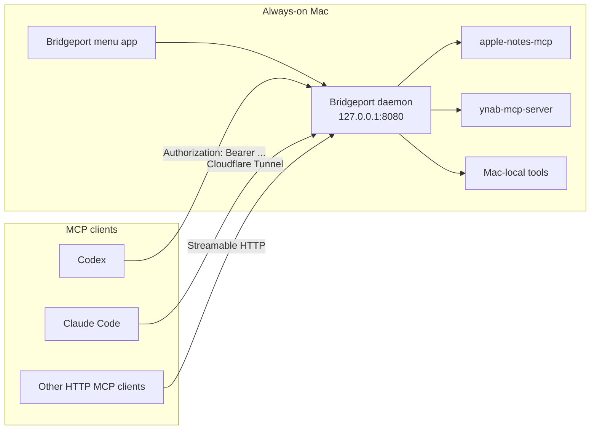

# Bridgeport

Bridgeport is a macOS 26 Tahoe menu bar utility and LaunchAgent daemon that turns this Mac into a personal MCP gateway. It discovers local stdio MCP servers from the tools already installed on the Mac, runs them on demand, and exposes them as authenticated local or Cloudflare-routed MCP endpoints.

Bridgeport is intended for connectors that need this Mac, local app data, local credentials, or inexpensive personal hosting. URL-only MCP servers are skipped because they already have hosted equivalents.

**Tagline:** Personal MCP gateway for Mac-local connectors.

## What It Does



Bridgeport:

1. Discovers MCP servers from plugin folders, `.mcp.json`, Claude plugin manifests, Codex plugin manifests, Antigravity MCP configs, Hermes plugin manifests, `.claude/settings.json`, and `.codex/config.toml`.
2. Skips web-hosted MCP entries that have a `url` and no local `command`.
3. Imports MCP definitions into Bridgeport-owned config, or mirrors external sources live.
4. Spawns each connector process on demand and bridges JSON-RPC over stdin/stdout.
5. Exposes modern Streamable HTTP endpoints at `/mcp/<connector>` plus legacy SSE endpoints at `/<connector>/sse` and `/<connector>/message`.
6. Authenticates with `Authorization: Bearer <token>` by default and advertises Bearer auth on 401 responses for remote connector auto-detection.
7. Generates cloud connector exports for Claude custom connectors, Anthropic Messages API MCP connectors, Mistral Work custom connectors, and Vibe Code CLI.
8. Shows active sessions, enabled connector count, public exposure state, and connector source paths in the UI.
9. Resolves secrets from process env, a mounted 1Password Environment `.env` file, Bridgeport config env, connector env, and `op://` references. Defaults are seeded from `~/.claude/.env` so Bridgeport stores references, not plaintext secrets.

## Quick Start

Build:

```bash
swift build
```

Run the menu bar app:

```bash
swift run bridgeport
```

Run the daemon directly:

```bash
swift run bridgeport --server
```

Install as a persistent LaunchAgent:

```bash
swift run bridgeport --daemon-install
```

Check daemon status:

```bash
swift run bridgeport --daemon-status
```

Run tests and smoke verification:

```bash
swift test
python3 test_client.py
```

Build and launch the `.app` bundle:

```bash
script/build_and_run.sh --verify
```

## Configuration

Bridgeport stores its config at `~/.config/bridgeport/config.json`.

```json
{
  "token": "ames_...",
  "port": 8080,
  "publicBaseURL": "https://mcp.amesvt.com",
  "bindHost": "127.0.0.1",
  "allowedOrigins": [
    "http://localhost:8080",
    "http://127.0.0.1:8080",
    "https://mcp.amesvt.com"
  ],
  "allowQueryTokenAuth": false,
  "connectorsPath": "/Users/oliverames/Developer/Projects/ames-connectors/plugins",
  "additionalConnectorPaths": [
    "/Users/oliverames/Developer/Projects/ynab-mcp-server",
    "/Users/oliverames/.claude/settings.json",
    "/Users/oliverames/.codex/config.toml"
  ],
  "connectorSettings": {
    "apple-notes": {
      "enabled": true,
      "exposePublicly": true,
      "publicPath": "apple-notes"
    },
    "node_repl": {
      "enabled": true,
      "exposePublicly": false
    }
  },
  "onePasswordEnvironment": {
    "enabled": true,
    "environmentName": "Bridgeport",
    "accountId": "",
    "environmentId": "",
    "localEnvFilePath": "~/.config/bridgeport/1password.env"
  },
  "env": {
    "YNAB_API_TOKEN": "op://Development/YNAB/api-token"
  }
}
```

For test isolation, `BRIDGEPORT_CONFIG_HOME=/tmp/bridgeport-test` redirects `config.json`, `mcp_config.json`, and `cloud_connectors.json`.

## Generated MCP Client Config

Bridgeport writes enabled connectors to `~/.config/bridgeport/mcp_config.json`.

```json
{
  "mcpServers": {
    "apple-notes": {
      "type": "http",
      "url": "https://mcp.amesvt.com/mcp/apple-notes",
      "headers": {
        "Authorization": "Bearer ames_..."
      }
    }
  }
}
```

Query-string tokens are disabled by default. Keep them off unless a legacy client cannot send headers. Public route paths are normalized to a safe single path segment before generated URLs are written.

## Cloud Connector Exports

Bridgeport writes public connector exports to `~/.config/bridgeport/cloud_connectors.json` and surfaces the same values in the **Cloud Connectors** settings pane. Only enabled connectors with the **Public** toggle are included.

Claude custom connectors are reached from Anthropic's cloud, not from this Mac. The Claude app custom connector dialog currently accepts a name, remote MCP server URL, and optional OAuth client details. It does not provide a static bearer-header field, so Bridgeport only marks Claude app URLs as ready when query-token fallback is explicitly enabled.

Anthropic Messages API MCP connector definitions use `authorization_token`, so they can keep header-style auth without putting a token in the URL:

```json
{
  "type": "url",
  "name": "apple-notes",
  "url": "https://mcp.amesvt.com/mcp/apple-notes",
  "authorization_token": "ames_..."
}
```

Mistral Work custom connectors can use the same public MCP URL and select or auto-detect HTTP Bearer Token auth:

```text
Name: apple-notes
Server URL: https://mcp.amesvt.com/mcp/apple-notes
Authentication: HTTP Bearer Token
Authorization header: Bearer ames_...
```

Vibe Code CLI can use the generated TOML:

```toml
[[mcp_servers]]
name = "apple-notes"
transport = "streamable-http"
url = "https://mcp.amesvt.com/mcp/apple-notes"
headers = { "Authorization" = "Bearer ames_..." }
```

## Import vs Mirror

Use **Import MCPs** when you want Bridgeport to copy connector definitions into its own config. Imported connectors keep working even if the original plugin folder moves, as long as the referenced command still exists.

Use **Mirror MCPs From...** when you want Bridgeport to keep reading an external source live. Good mirror sources include:

- `/Users/oliverames/Developer/Projects/ames-connectors/plugins`
- `/Users/oliverames/Developer/Projects/ynab-mcp-server`
- `/Users/oliverames/.claude/settings.json`
- `/Users/oliverames/.codex/config.toml`
- `/Users/oliverames/.claude/plugins/cache/apple-notes-mcp/apple-notes/<version>`

The Sources settings pane also has one-click actions for the default Claude Code and Codex config paths. Both flows keep URL-only web MCPs out of Bridgeport and default newly discovered local MCPs to private, non-public exposure.

## Environment And 1Password

Connector processes receive environment values in this order, with later sources overriding earlier ones:

1. Bridgeport daemon process environment.
2. Mounted 1Password Environment `.env` file, when enabled in Settings.
3. Bridgeport `env` values from `config.json`.
4. Connector-specific `env` values from the MCP definition.

Values can reference earlier environment variables with `${NAME}` and can use `op://` references. Bridgeport resolves `op://` values with the 1Password CLI (`op read`) at connector start.

The 1Password settings pane stores metadata for the Environment plus the local mounted `.env` path. It does not create or mutate a 1Password Environment itself.

## Endpoints

Modern Streamable HTTP:

```http
POST /mcp/<connector>
Authorization: Bearer <token>
Accept: application/json, text/event-stream
Content-Type: application/json
```

Legacy SSE:

```http
GET /<connector>/sse
Authorization: Bearer <token>
```

Webhook broadcast:

```http
POST /<connector>/webhook
Authorization: Bearer <token>
Content-Type: application/json
```

Runtime status:

```http
GET /status
Authorization: Bearer <token>
```

## Cloudflare

Bridgeport should bind to `127.0.0.1` when exposed through Cloudflare Tunnel. Point the tunnel hostname, for example `mcp.amesvt.com`, at `http://localhost:<port>`, then set `publicBaseURL` to that hostname in Bridgeport.

Expose connectors individually with their **Public** toggle. The generated client config uses the public base URL only for connectors marked public.

See [CLOUDFLARE.md](CLOUDFLARE.md) for tunnel setup and security recommendations.

## CLI Reference

| Flag | Description |
|------|-------------|
| `--server` | Run in headless daemon mode |
| `--port <port>` | HTTP port |
| `--token <token>` | Master bearer token |
| `--connectors-path <path>` | Primary MCP source path |
| `--public-base-url <url>` | Public base URL for generated client config |
| `--bind-host <host>` | Bind host, default `127.0.0.1` |
| `--allow-query-token-auth` | Enable legacy `?token=` auth fallback |
| `--daemon-install` | Install and start LaunchAgent |
| `--daemon-uninstall` | Stop and remove LaunchAgent |
| `--daemon-status` | Print LaunchAgent status |
| `--rotate-token` | Generate and save a new master token |

## Requirements

- macOS 26 Tahoe
- Swift 6.2+
- 1Password CLI for `op://` secret resolution
- FlyingFox, via SwiftPM
- Developer ID Application certificate for signed DMG releases

## Release Checks

```bash
swift build
swift test
python3 test_client.py
script/build_and_run.sh --verify
script/package_release.sh 1.0
script/notarize_release.sh dist/release/Bridgeport-1.0.dmg
```

`test_client.py` uses an isolated `BRIDGEPORT_CONFIG_HOME` and a free local port so it can run alongside an installed Bridgeport daemon.

`script/package_release.sh` builds a release `.app`, signs it with the first available Developer ID Application identity or `BRIDGEPORT_SIGN_IDENTITY`, creates `dist/release/Bridgeport-<version>.dmg`, and signs the DMG.

`script/notarize_release.sh` retrieves the App Store Connect `.p8` from 1Password, submits the DMG with `notarytool`, staples the ticket, and runs `spctl` verification.

## License

Private. Copyright Oliver Ames.
